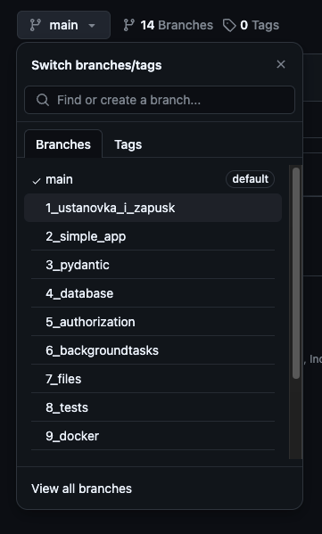

## FastAPI курс
Быстрое погружение в самый популярный Python Backend фреймворк

### 👉 [Плейлист со всеми видео](https://www.youtube.com/playlist?list=PLeLN0qH0-mCVQKZ8-W1LhxDcVlWtTALCS)

#### Для перехода на конкретный урок перейдите на другую ветку: 
Например, вот [ветка 1ого урока](https://github.com/artemonsh/fastapi-course/tree/1_ustanovka_i_zapusk) 

